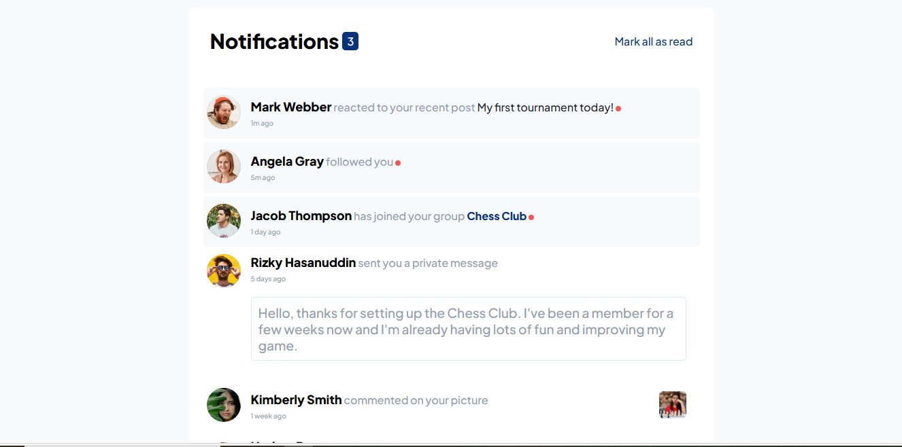

# Frontend Mentor - Notifications page

This is a solution to the [Notifications page](https://www.frontendmentor.io/challenges/notifications-page-DqK5QAmKbC). Frontend Mentor challenges help you improve your coding skills by building realistic projects.

## Table of contents

- [Overview](#overview)
  - [The challenge](#the-challenge)
  - [Screenshot](#screenshot)
  - [Links](#links)
  - [Installation](#Installation)
- [My process](#my-process)
  - [Features](#Features)
  - [What I learned](#what-i-learned)
  - [Continued development](#continued-development)
- [Author](#author)
- [Acknowledgments](#Acknowledgments)

## Overview

### The challenge

This project will be a brilliant test of your HTML, CSS, and basic JavaScript skills. You'll use JS to toggle the visual state of the notifications.

Your users should be able to:

- Distinguish between "unread" and "read" notifications
- Select "Mark all as read" to toggle the visual state of the unread notifications and set the number of unread messages to zero
- View the optimal layout for the interface depending on their device's screen size
- See hover and focus states for all interactive elements on the page

### Screenshot



### Links

- Solution URL: [here](https://github.com/olahasan/HTML_CSS_AND_J.S_Frontend-Mentor_JUNIOR-Notifications-page)

- Live Site URL: [here](https://olahasan.github.io/HTML_CSS_AND_J.S_Frontend-Mentor_JUNIOR-Notifications-page/)

## Installation

To get a local copy up and running, follow these simple steps:

1. **Clone the repository**:

   ```sh
   git clone https://github.com/your-username/your-repo-name.git
   ```

2. **Navigate to the project directory**:

   ```sh
   cd your-repo-name
   ```

3. **Open the project in your preferred code editor**.

## My process

## Features

- **Responsive Design**: The page is fully responsive and works well on different screen sizes.
- **Interactive Elements**: Users can mark all notifications as read, which updates the notification count and changes the styles accordingly.
- **Lazy Loading**: Images are lazy-loaded to improve performance.
- **Semantic HTML**: The HTML structure is semantic and accessible.

### What I Learned

- **CSS Variables**: I learned how to use CSS variables to maintain consistent styling across the project.
- **Flexbox**: I improved my understanding of Flexbox for creating flexible and responsive layouts.
- **JavaScript DOM Manipulation**: I enhanced my skills in manipulating the DOM using JavaScript to create interactive elements.
- **Responsive Design**: I learned how to use media queries to make the design responsive and ensure it looks good on different devices.

### Continued Development

- **Accessibility Improvements**: I plan to add more accessibility features, such as focus styles for interactive elements and ARIA roles.
- **Code Optimization**: I aim to further optimize the JavaScript code for better performance and readability.
- **Additional Features**: I would like to add more features, such as filtering notifications and adding animations for better user experience.

### Author

Frontend Mentor - @olahasan<br>
GitHub - @olahasan

### Acknowledgments

I would like to thank the **Frontend Mentor** for providing this challenge and to the community for their support and feedback
